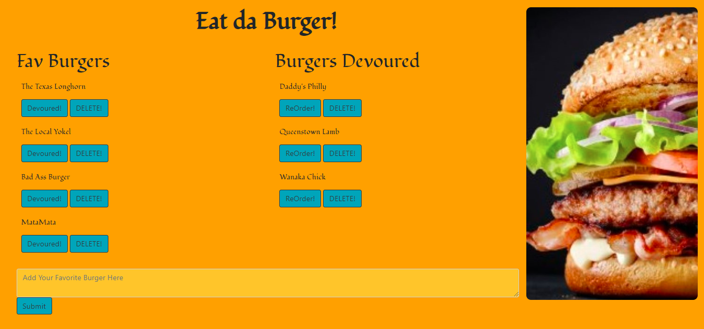

# KC_Burger - Node Express Handlebars
This app is about your favorite burgers! It's a burger logger using MySQL, Node, Express, Handlebars, and a homemade ORM (yum!).

**Github Username:** 
 # Karna1014
 
 ## Description: 
 This app follows an MVC design pattern; uses Node-Express and MySQL to query and route data to the app; finally, Handlebars generates the HTML to give a polished look.

 
 ## Table of Contents: 
  * Instructions
  * Installation 
  * Requirements
  * License 
  * Contributing 
  * Questions 
  * Images 

   #### Instructions:

   1. Add your favorite burger to the 'Fav" list.
   2. "Devour" it using the button - it moves to the "Devoured" list.
   3. Move it back using the "ReOrder" button.
   4. Don't like that one - "Delete" it!

   #### Installation: 

   npm install
   
   ### Requirements: 

   * [Node.js] (https://nodejs.org/en/)
   * [MySQL Workbench] (https://www.mysql.com/products/workbench)
   * NPM Packages:
            * [Express] 
            * [MySQL]
            * [Express-Handlebars]
            * [dotenv]
    
   
   #### License: 

   ISC: 
   
   ### Contributions: Karna Cutolo

   
   ### Questions: 
      
   #### If you have any questions about this repo, please reach out: 

   **Email: karna.cutolo@gmail.com**
     
   #### Images:

   
